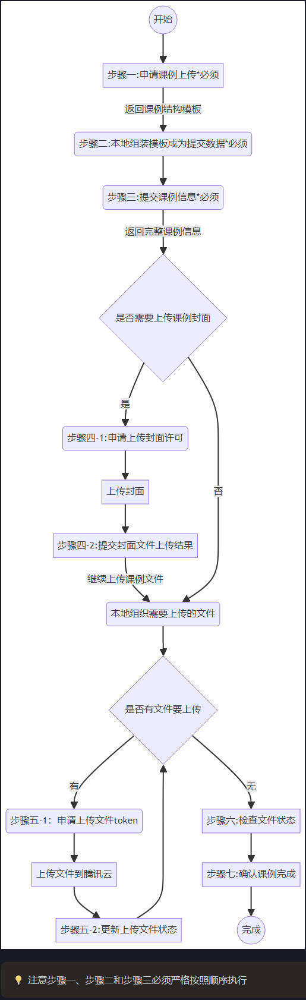

# 2025年相较于2024年变化

1. 获取accessToken接口：加强了安全性，返回值有变化，详见[文档](./document/%E8%8E%B7%E5%8F%96accessToken%E6%8E%A5%E5%8F%A3%E6%96%87%E6%A1%A3.md)和示例([示例](./src/main/java/com/qlteacher/demo/AccessTokenDemo.java))
2. 读取传课配置接口：activity/structures/{actId}，增加RequestParam adviserCount 指导教师数
3. 申请接口上传接口：otoel-upload/lesson/apply，增加RequestParam adviserCount 指导教师数
4. userType枚举增加 adviser指导教师

[2025年规则检查及提示信息表](document/2025regular.md)

# 2025年创课目录

[2025年创课目录](document/2025年度创课目录.xlsx)

# demo目录结构

- src/main/java/ java代码目录
    - com.qlteacher.demo 演示用例基础包
        - baseinfo 基础信息类查询例子包
        - lesson 课例上传用例子包
        - pojo 实体类包
            - conf 配置类包
            - dto 数据传递类包
            - param 提交参数类包
            - vo 返回对象类包
        - process 流程类包
        - utils 工具类包
    - resource 配置文件和资源目录
        - file 资源文件目录

# 推荐

推荐参照流程图，直接使用process目录下步骤Process1~7，即可完整走完一个上传流程

## 上传课例流程图

## 一师一课接口文档

[document/获取accessToken接口文档.md](./document/%E8%8E%B7%E5%8F%96accessToken%E6%8E%A5%E5%8F%A3%E6%96%87%E6%A1%A3.md)

[document/获取accessToken接口文档.pdf](./document/获取accesstoken接口文档.pdf)

[document/一师一优课2025接口文档.md](./document/%E4%B8%80%E5%B8%88%E4%B8%80%E4%BC%98%E8%AF%BE2025%E6%8E%A5%E5%8F%A3%E6%96%87%E6%A1%A3.md)

[document/一师一优课2025接口文档.pdf](./document/一师一优课2025接口文档.pdf)
